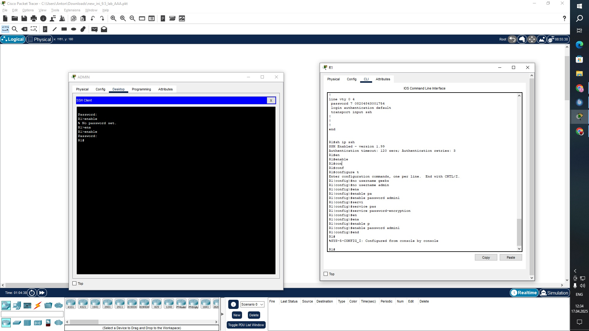
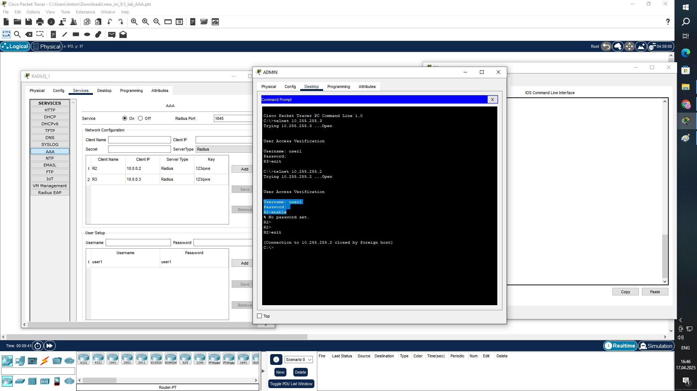
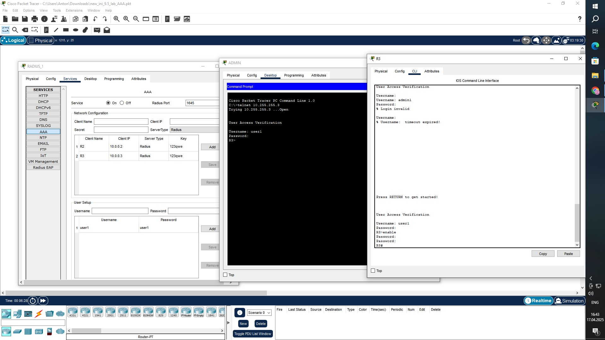

# Домашнее задание к занятию "Средства и протоколы для аутентификации, авторизации и аккаунтинга сетевых устройств"

# Задание 1. Выполняется на R1

Создать локального пользователя admin1 и пароль к нему admin1

Войти по telnet с терминала

Войти в привелигированный режим enable

Сохранить конфигурацию

Убедиться, что пароль сохранен в зашифрованном виде

Ответьте на вопрос: были ли проблемы при входе в привелигированный режим enable или другие проблемы, если были, то как решили? Если проблем не было, то какие могли бы быть?

Ответ на задание представить в виде вывода команды show run с R1 в файле .txt, файл назвать 9.5_ЗАДАНИЕ_1, ответ на вопрос так же можно предстваить в начале файла в свободной форме.

# ОТВЕТ:

Building configuration...

Current configuration : 1680 bytes
!
version 15.1
no service timestamps log datetime msec
no service timestamps debug datetime msec
service password-encryption
!
hostname R1
!
!
!
enable password 7 08204843001754
!
!
!
!
!
aaa new-model
!
aaa authentication login SSH-LOGIN local 
aaa authentication login default local 
!
!
!
!
!
!
!
no ip cef
no ipv6 cef
!
!
!
username admin1 privilege 15 secret 5 $1$mERr$7n6je7c9FKvO.o.40Rj1Q0
username cisco1 privilege 15 secret 5 $1$mERr$q.MA2tj.WFptzvbifq/1i.
!
!
license udi pid CISCO2901/K9 sn FTX15242VED-
!
!
!
!
!
!
!
!
!
no ip domain-lookup
ip domain-name admin1
!
!
spanning-tree mode pvst
!
!
!
!
!
!
interface GigabitEthernet0/0
 ip address 10.255.255.1 255.255.255.0
 duplex auto
 speed auto
!
interface GigabitEthernet0/1
 ip address 10.0.0.1 255.255.255.0
 duplex auto
 speed auto
!
interface FastEthernet0/2/0
 switchport mode access
 switchport nonegotiate
!
interface FastEthernet0/2/1
 switchport mode access
 switchport nonegotiate
!
interface FastEthernet0/2/2
 switchport mode access
 switchport nonegotiate
!
interface FastEthernet0/2/3
 switchport mode access
 switchport nonegotiate
!
interface FastEthernet0/3/0
 switchport mode access
 switchport nonegotiate
!
interface FastEthernet0/3/1
 switchport mode access
 switchport nonegotiate
!
interface FastEthernet0/3/2
 switchport mode access
 switchport nonegotiate
!
interface FastEthernet0/3/3
 switchport mode access
 switchport nonegotiate
!
interface Vlan1
 no ip address
 shutdown
!
ip classless
!
ip flow-export version 9
!
!
!
!
!
!
!
line con 0
 login authentication default
!
line aux 0
!
line vty 0 4
 password 7 08204843001754
 login authentication default
 transport input ssh
!
!
!
end

Были проблемы с rsa ключом, пришлось переименовать хост. И для пользователя нужно было активировать пароль.

# Задание 2. Выполняется на R2 и RADIUS_1

Создать следующие настройки AAA на R2:

aaa new-model

aaa authentication login default group radius

radius-server host 10.0.0.4 auth-port 1645 key 123qwe

Создать на RADIUS_1 клиента R2 10.0.0.2 с ключом 123qwe

Создать на RADIUS_1 пользователя user1 с паролем user1

Войти на R2 в режим enable

Выключить сервер RADUIS_1

Войти на R2 по telnet

Ответить на вопрос: были ли проблемы при выполнении пунктов 4 и 6? Если были, то как решили? Если проблем не было, то какие могли бы быть?
Ответ на задание представить в виде вывода команды show run с R2 в файле .txt и скриншот настроек RADIUS_1 Файл назвать 9.5_ЗАДАНИЕ_2, ответ на вопрос так же можно предстваить в начале файла в свободной форме.

# ОТВЕТ:

Проблемы были в том, что есть отличие комманд в osi 9 и osi 15 cisco.

# Задание 3. Выполняется на R3 и RADIUS_1 и RADIUS_2.

Выполнить на R3 все настройки из задания 1 и 2 (локальный пользователь и клиент серверов R3)
Создать конфигурацию AAA с резервированием серверов RADIUS
Проверить доступность R3 по telnet с поочередным отключением серверов 1 и 2
Ответ на задание представить в виде вывода команды show run с R3 в файле .txt и скриншот настроек RADIUS_1 и 2
Файл назвать 9.5_ЗАДАНИЕ_3.

R3#show running-config 

Building configuration...

Current configuration : 1812 bytes

!

version 15.1

no service timestamps log datetime msec

no service timestamps debug datetime msec

service password-encryption

!

hostname R3

!

!

!

enable password 7 08204843001754

!

!

!

!

!

aaa new-model

!

aaa authentication login default group radius local 

!

!

aaa authorization exec default group radius group radius

!

!

!

!

!

no ip cef

no ipv6 cef

!

!

!

username admin1 privilege 15 secret 5 $1$mERr$7n6je7c9FKvO.o.40Rj1Q0

!

!

license udi pid CISCO2901/K9 sn FTX1524P2X8-

!

!

!

!

!

!

!

!

!

ip ssh version 1

no ip domain-lookup

ip domain-name netology

!

!

spanning-tree mode pvst

!

!

!

!

!

!

interface GigabitEthernet0/0

 ip address 10.255.255.3 255.255.255.0
 
 duplex auto
 
 speed auto
!

interface GigabitEthernet0/1

 ip address 10.0.0.3 255.255.255.0
 
 duplex auto
 
 speed auto
!

interface FastEthernet0/2/0

 switchport mode access
 
 switchport nonegotiate
!

interface FastEthernet0/2/1

 switchport mode access
 
 switchport nonegotiate
!

interface FastEthernet0/2/2

 switchport mode access
 
 switchport nonegotiate
!

interface FastEthernet0/2/3

 switchport mode access
 
 switchport nonegotiate
!

interface FastEthernet0/3/0

 switchport mode access
 
 switchport nonegotiate
!

interface FastEthernet0/3/1

 switchport mode access
 
 switchport nonegotiate
!

interface FastEthernet0/3/2

 switchport mode access
 
 switchport nonegotiate
!

interface FastEthernet0/3/3

 switchport mode access
 
 switchport nonegotiate
!

interface Vlan1

 no ip address
 
 shutdown
!

ip classless

!

ip flow-export version 9

!

!

!
!

radius server RADIUS_1

 address ipv4 10.0.0.4 auth-port 1654
 
 key 123qwe

radius server 10.0.0.4

 address ipv4 10.0.0.4 auth-port 1645
 
 key 123qwe

!

!

!

line con 0

!

line aux 0

!

line vty 0 4

 
 password 7 08204843001754
 
 transport input telnet

line vty 5 15

 password 7 08204843001754
 
 transport input telnet
!

!

!

end
